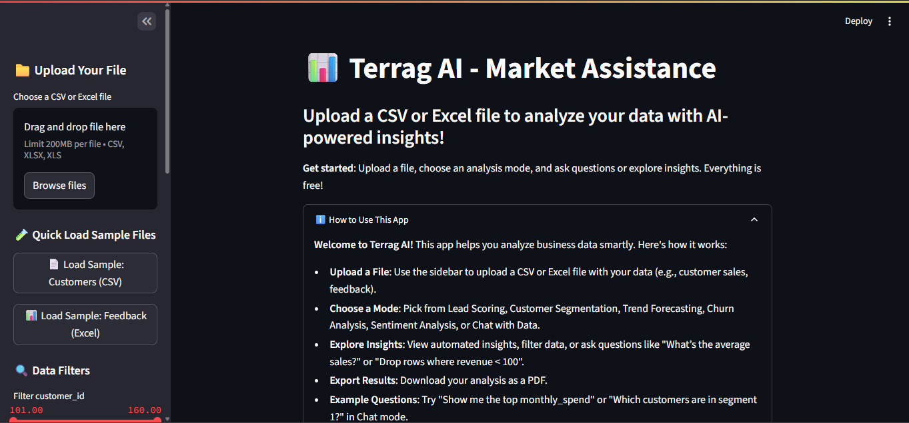
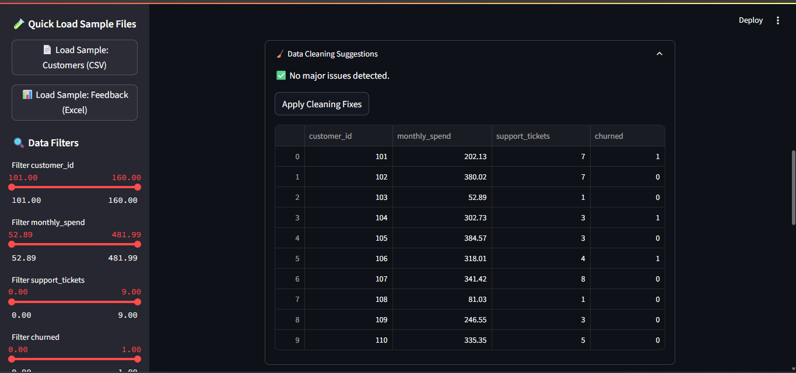
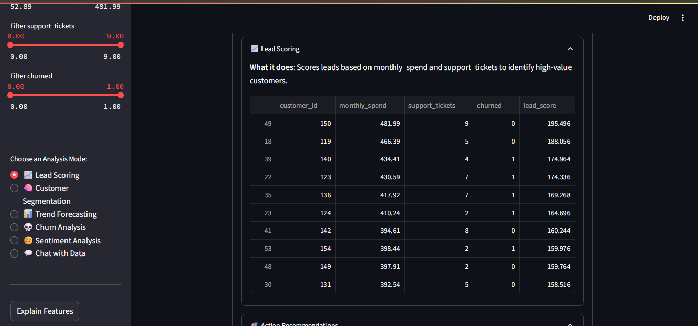
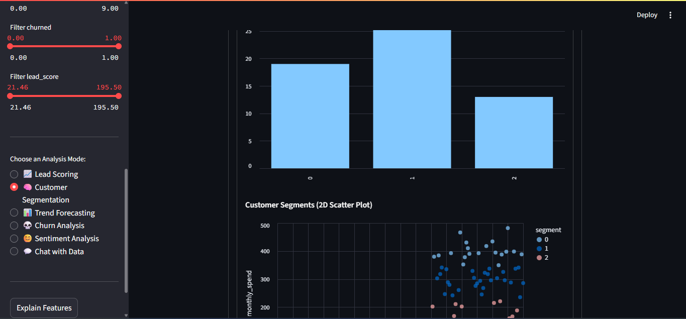
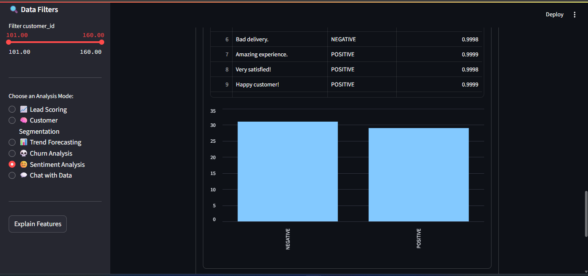
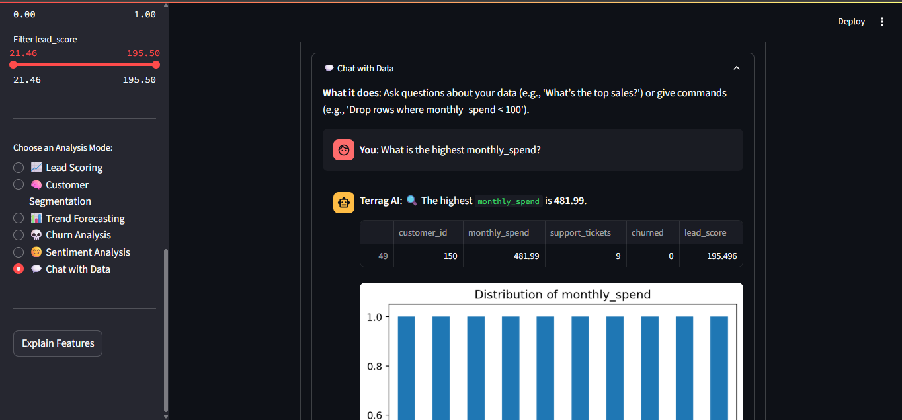

# 📈 Terrag AI - Market Assistance

Terrag AI is a **Streamlit-based AI-powered data analytics app** that provides intelligent insights from your business datasets like customers, feedback, and sales data.

This project is part of the **Advtrix Learning** repository.

---

## 🚀 Features

* 📂 **Upload CSV/Excel** files for analysis
* 📈 **Lead Scoring** for customer prioritization
* 🧠 **Customer Segmentation** via KMeans clustering
* 📊 **Trend Forecasting** on time-series data
* 💀 **Churn Analysis** for churn prediction insights
* 😊 **Sentiment Analysis** on textual feedback
* 💬 **Chat with Data** using natural language questions
* 📄 **Export Analysis as PDF**
* 🧹 **Data Cleaning Suggestions**

---

## 🛠️ Installation & Setup

### 1. Clone the Repository

```bash
git clone https://github.com/MuhammadTahaNasir/advtrix-learning.git
cd advtrix-learning/streamlit_app
```

### 2. Install Dependencies

Ensure Python 3.8+ is installed. Then install required packages via:

```bash
pip install -r requirements.txt
```

### 3. Run the Streamlit App

```bash
streamlit run app.py
```

Once running, Streamlit will provide a local URL like:

```
http://localhost:8501
```

> Open this link in your browser to interact with the app.

---

## 🥉 Requirements

All necessary dependencies are listed in `requirements.txt`:

```
streamlit
pandas
numpy
matplotlib
altair
scikit-learn
openpyxl
sentence-transformers
transformers
torch
```

Optional:

```
seaborn
```

Install them all via:

```bash
pip install -r requirements.txt
```

---

## 🖼️ Screenshots

| Feature               | Preview                                       |
| --------------------- | --------------------------------------------- |
| Home & File Upload    |                  |
| Data Cleaning         |          |
| Lead Scoring          |  |
| Customer Segmentation |  |
| Sentiment Analysis    |        |
| Chat with Data        |                  |

> Screenshots are located in the `screenshots/` folder.

---

## 📆 Project Structure

```
advtrix-learning/
└── streamlit_app/
    ├── app.py
    ├── requirements.txt
    ├── README.md
    └── screenshots/
```

---

## 📧 Contact

Developed by **Muhammad Taha Nasir**

* GitHub: [MuhammadTahaNasir](https://github.com/MuhammadTahaNasir)
* LinkedIn: [Muhammad Taha Nasir](https://linkedin.com/in/muhammadtahanasir)

---

## ✅ License

This project is part of the what I learned through my journey at advtix and developed something using my knowledge. Use is allowed for learning, modification, and educational purposes.

---
